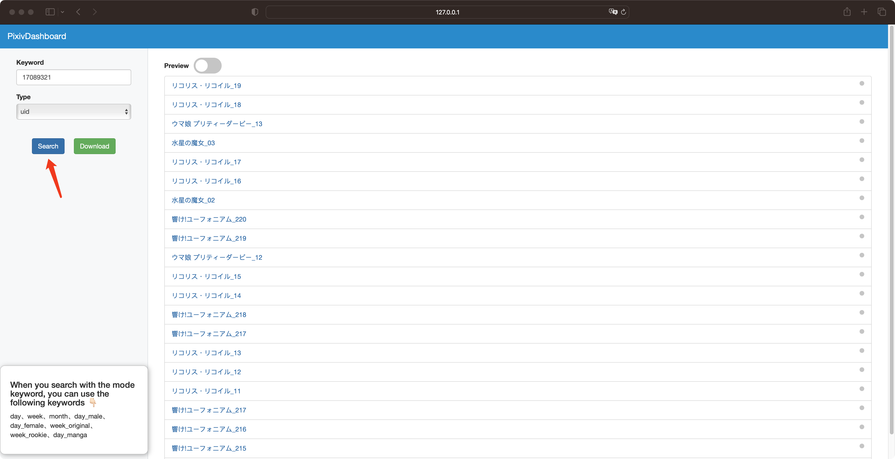
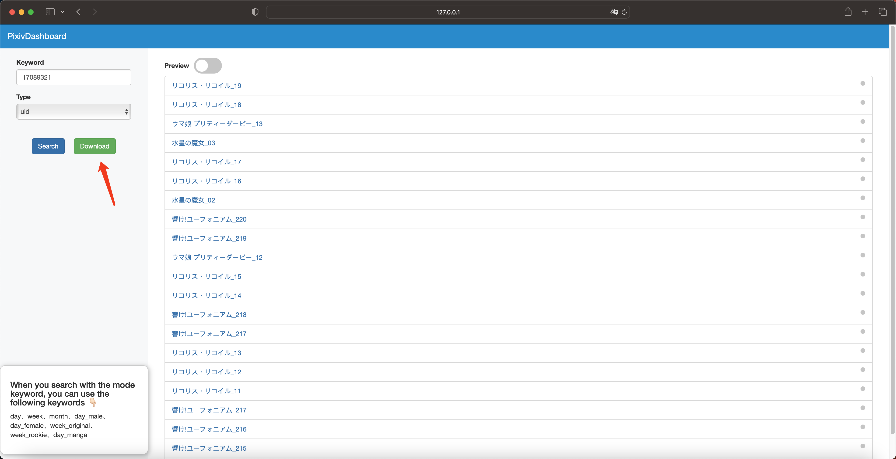
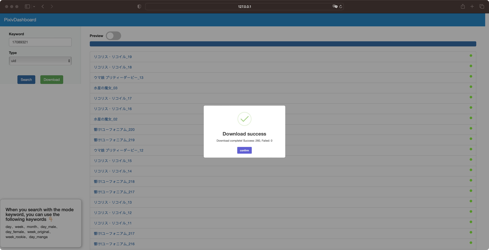

# pppixiv
[](https://img.shields.io/github/actions/workflow/status/MGMCN/pppixiv/pr.yml?logo=github)
[](https://hub.docker.com/r/godmountain/pppixiv)
[](https://github.com/MGMCN/pppixiv/issues?logo=github)
[](https://github.com/MGMCN/pppixiv/blob/main/LICENSE)


Get links to pixiv illustrations and links to download illustrations via our api. 
Please note that this project is a subproject of [tg-dumb-bot](https://github.com/hackroid/tg-dumb-bot). Since the current api is designed for tg-dumb-bot, you don't have easy access to the links we return (telegram comes with previews). 
For example, you need to call the pixivAPI variable inside our service to use the download link. 
Also you can modify our source code directly. 
We will provide more features for this project later.

## Usage
### Build with Docker
Build your docker image and run it.
```bash
# build locally
$ docker build . -t pixiv
# run on detach (notice : -v will specify the folder where the illustrations will be downloaded)
$ docker run -d -p 3333:5000 -e username="your_pixiv_accout_name" -e password="your_pixiv_account_password" -v /Your/local/path/dir:/APP/Illusts pixiv
# run in foreground
$ docker run -it -p 3333:5000 -e username="your_pixiv_accout_name" -e password="your_pixiv_account_password" -v /Your/local/path/dir:/APP/Illusts pixiv
```
If you successfully run this image up, you can run the test.py file to see the output. The first time will be slower because you have to get the pixiv token.
```bash
$ python3 test.py # Make sure you have the requests library installed
```
### Use DockerHub Image
Pull our built image directly.
```bash
$ docker pull godmountain/pppixiv:latest
$ docker run -d -p 3333:5000 -e username="your_pixiv_accout_name" -e password="your_pixiv_account_password" -v /Your/local/path/dir:/APP/Illusts godmountain/pppixiv:latest
```
### Run the code without docker
Create .env file and Illusts folders.
```
.
├── .env 👈🏻 Paste your pixiv account and password into the .env file.
├── Illusts 👈🏻 Create the Illusts folder in the root directory of the project.
├── Dockerfile
├── LICENSE
├── README.md
├── app.py
├── image
├── main.py
├── requirements.txt
├── router
├── run.sh
├── services
├── static
├── templates
└── test.py
```
.env should like 👇🏻
```
username=xxx
password=xxx
```
Add chromedriver to your environment variable. (Notice : The chromedriver version should be the same as the chrome browser you downloaded.) Please google how to set chromedriver environment variables by yourself. 
Then execute the following two commands after you have set up chromedriver.
```bash
$ pip3 install -r requirements.txt
$ python3 main.py
```
## Visit our dashboard
Visit```http://ip:port/dashboard```.You will see 👇🏻
Then enter the uid and click the search button, all the illustrations of the user with the specified uid will be searched and displayed on the right side.  

   
  
Click the download button and all illustrations will be downloaded. If the download is successful, the gray dot on the right will turn green. Failed downloads will turn red.  

   

After the illustration is downloaded successfully you will see the following message.

   

Click the Preview button to preview the illustration you just downloaded.

  

The artist in this example is referenced from [仁井学](https://www.pixiv.net/users/17089321).

## Api for accessing our pixiv services
Visit```http://ip:port/getIllustListByUid```and post data ```{"uid":"xxx"}```.You will get 👇🏻
> status : 0 stands for failure while 1 stands for success  
> message : error message  
> list : returned data
```json lines
{
  "status": 1,
  "message": "message",
  "list": [
    {"title": "title1", "url": "preview_url", "download_url":  "download_url"},
    {},
    {},
  ]
}
```

Visit```http://ip:port/getIllustRanking```and post data ```{"mode":"xxx"}```. (We have mode: day, week, month, day_male, day_female, week_original, week_rookie, day_manga) You will get 👇🏻
```json lines
{
  "status": 1,
  "message": "message",
  "list": [
    {"title": "title1", "url": "preview_url", "download_url":  "download_url"},
    {},
    {},
  ]
}
```

Visit```http://ip:port/getTrendingTags```.
You will get 👇🏻
```json lines
{
  "status": 1,
  "message": "message",
  "list": [
    {"tag": "JP version(Unicode)", "translated_tag": "EN version"},
    {},
    {},
  ]
}
```
Visit```http://ip:port/getIllustDownloadUrl```and post data ```{"illust_id":"xxx"}```.
You will get 👇🏻
```json lines
{
  "status": 1,
  "message": "message",
  "list": [
    {"title": "title", "url": "preview_url", "download_url":  "download_url"},
  ]
}
```
## Contributing
Contributions must be available on a separately named branch based on the latest version of the main branch.
